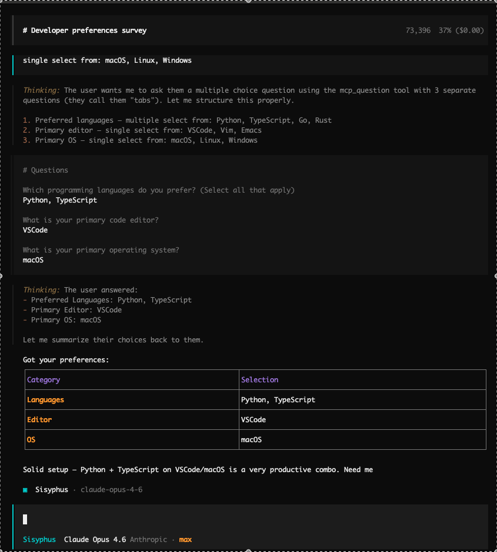

# MARS — Multi-Agent Runtime Studio

An AI agent orchestration engine. Coordinates multiple CLI-based AI agents to automatically decompose, execute, and verify complex software projects.



## Architecture

```
┌─────────────────────────────────────────────────────┐
│  Frontend (Next.js 16)        :3000                 │
│  Dashboard · Projects · Tasks · Agents · Terminal   │
├─────────────────────────────────────────────────────┤
│  Backend (Bun + Hono-style)   :3001                 │
│  ┌───────────────────────────────────────────────┐  │
│  │ Orchestrator Engine                           │  │
│  │  TaskDecomposer → ReactiveScheduler → Engine  │  │
│  │  AgentPool → AgentProcess → CLI Executor      │  │
│  │  ResultReviewer → Phase Gate → Artifact Bus   │  │
│  ├───────────────────────────────────────────────┤  │
│  │ Reactive Scheduler                            │  │
│  │  Dependency Resolution (blocks / informs)     │  │
│  │  Fail-Stop Cascade · Phase Gate Enforcement   │  │
│  │  Parent Status Derivation                     │  │
│  ├───────────────────────────────────────────────┤  │
│  │ Execution Layer                               │  │
│  │  Context Builder · Agent Runner · Session Mgr │  │
│  │  Codex CLI · Claude CLI · OpenAI Provider     │  │
│  ├───────────────────────────────────────────────┤  │
│  │ SQLite (bun:sqlite)                           │  │
│  │  providers · agents · skills · projects       │  │
│  │  tasks · task_dependencies · runs             │  │
│  │  task_executions · messages · mcp_servers     │  │
│  └───────────────────────────────────────────────┘  │
└─────────────────────────────────────────────────────┘
```

## Key Features

**Orchestration Engine**
- Task decomposition — LLM breaks high-level goals into executable subtasks
- Reactive scheduling — dependency-based dynamic scheduling, ready/blocked transitions every tick
- Multi-agent pool — configurable worker count per agent, parallel execution

**Fail-Stop Cascade**
- `blocks` dependency: downstream proceeds only when upstream is done
- `informs` dependency: downstream proceeds when upstream reaches any terminal state (done/failed/cancelled)
- Transitive cascade — upstream failure triggers recursive cancellation of all downstream tasks

**Artifact Bus**
- Auto-injects completed task artifacts (output, filesModified) into downstream task system prompts
- Truncation caps: 4K per artifact, 12K total
- Provides downstream task hints to upstream agents

**Phase Gate**
- Enforces sequential execution order via `phase` / `phaseOrder`
- All tasks in the current phase must complete before the next phase opens
- e.g. pm_definition → design → implementation → qa

**Human-in-the-Loop (HITL)**
- 3-tier approval levels (auto / confirm / block)
- Interaction gate — agents can request human approval or ask questions
- Recovery manager — restores pending interactions on server restart

**Other**
- Result reviewer — automated review + acceptance criteria validation
- MCP server integration — connect external tools to agents
- Real-time event streaming (SSE)
- Web terminal (xterm.js + WebSocket)

## Requirements

- [Bun](https://bun.sh) >= 1.0
- [Node.js](https://nodejs.org) >= 20 (frontend)
- At least one AI provider:
  - [Codex CLI](https://github.com/openai/codex) (OpenAI)
  - [Claude CLI](https://docs.anthropic.com/en/docs/claude-cli) (Anthropic)

## Installation

```bash
# Clone
git clone https://github.com/Chocothin/mars.git
cd mars

# Backend dependencies
bun install

# Frontend dependencies
cd frontend && npm install && cd ..
```

## Usage

### Running the Server

```bash
# Backend (port 3001)
bun src/index.ts

# Frontend (port 3000) — separate terminal
cd frontend && npm run dev
```

Open `http://localhost:3000` in your browser.

### Getting Started

1. **Register a Provider** — Add an AI provider with its API key in Settings
2. **Create an Agent** — Configure model, system prompt, and worker count
3. **Create a Project** — Set the working directory and assign agents
4. **Create a Task** — Enter a high-level goal → auto-decomposition → execution

### API

```bash
# List projects
curl http://localhost:3001/api/projects

# Create a task
curl -X POST http://localhost:3001/api/projects/:id/tasks \
  -H 'Content-Type: application/json' \
  -d '{"title": "Implement auth module", "description": "..."}'

# Start a run
curl -X POST http://localhost:3001/api/projects/:id/runs \
  -H 'Content-Type: application/json' \
  -d '{"taskIds": ["task-1", "task-2"], "autoReview": true}'
```

### Testing

```bash
# Run all tests
bun test

# Run a specific test
bun test src/__tests__/orchestrator/fail-stop.test.ts

# Type check
bun run typecheck
```

## Project Structure

```
src/
├── orchestrator/      # Engine core — scheduler, decomposer, reviewer
├── execution/         # Agent execution — context builder, runner
├── providers/         # CLI executors — Codex, Claude
├── db/                # SQLite repository layer
├── routes/            # REST API routes
├── types/             # Type definitions
├── events/            # Event bus (SSE)
├── hitl/              # Human-in-the-Loop interactions
├── terminal/          # Web terminal (WebSocket)
├── mcp/               # MCP protocol integration
├── skills/            # Skill system
├── tasks/             # Task service
└── __tests__/         # Tests
frontend/              # Next.js 16 dashboard
```

## License

[MIT](LICENSE)
